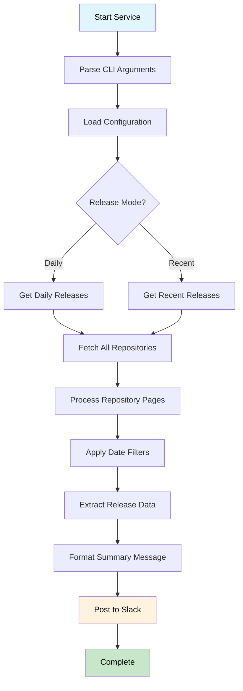
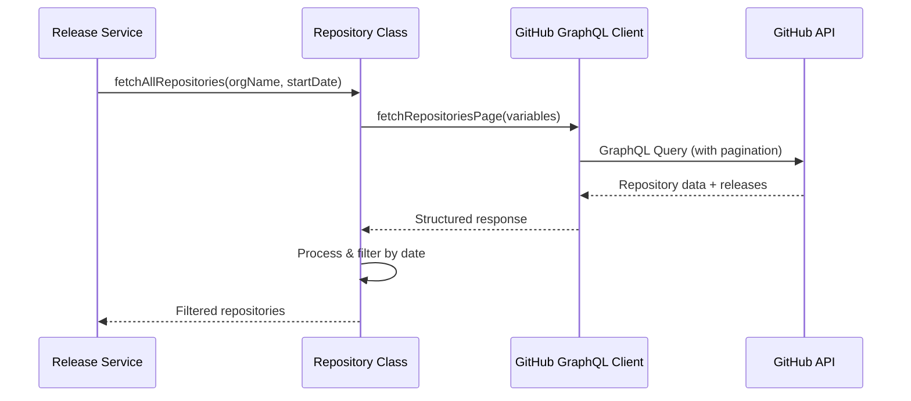
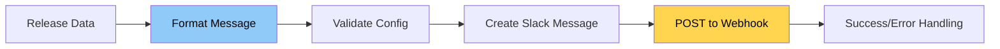

# GitHub Release Digest

> Automated GitHub release summary service that fetches and posts daily/recent release summaries to Slack

[](https://nodejs.org)
[](https://www.typescriptlang.org)
[](#testing)

## 🎯 Overview

GitHub Release Digest is a TypeScript service that monitors GitHub repositories within an organization, collects release information, and automatically posts formatted summaries to Slack channels. It supports both scheduled daily summaries and on-demand recent release queries.

## 🏗️ Business Logic Workflow

### High-Level Process Flow



### Detailed Workflow Components

#### 1. 🔧 Configuration & Setup

- __Environment Validation__: Validates required environment variables (`GITHUB_TOKEN`, `SLACK_WEBHOOK_URL`, `ORG_NAME`)
- **CLI Processing**: Parses command-line arguments for mode overrides
- **Logger Initialization**: Sets up contextual logging with timestamps

#### 2. 📥 Data Fetching Pipeline

**Repository Discovery**



**Key Features:**

- **Pagination**: Handles large organizations with 100+ repositories
- **Early Stopping**: Stops fetching when repositories updates are older than cutoff date (7 days)
- **Retry Logic**: Exponential backoff for API failures (3 retries max)
- **Rate Limiting**: 100ms delay between API pages

#### 3. 🔍 Release Processing

**Date-Based Filtering**

- **Daily Mode**: Filters releases published on a specific date (UTC)
- **Recent Mode**: Filters releases within specified hours (default: 24 hours)

**Data Transformation**

```typescript
// Raw GitHub Release → Structured ReleaseInfo
{
  repository: "org/repo-name",
  tagName: "v1.2.3",
  name: "Version 1.2.3",
  publishedAt: "2024-01-15T10:30:00Z",
  description: "Cleaned and formatted description",
  url: "https://github.com/org/repo/releases/tag/v1.2.3",
  author: "username",
  isPrerelease: false
}
```

#### 4. 📋 Summary Generation

**Two Format Options:**

**Tabular Format** (Default)

- Compact table view with repository, version, date, description
- Statistics summary (total releases, stable vs prerelease, repository count)

**Detailed Format**

- Full release descriptions with proper formatting
- Numbered list of releases
- Enhanced metadata display

#### 5. 📤 Slack Integration

**Message Flow**




## 🏛️ Architecture Overview

### Core Components

```ini
src/
├── 🎯 main.ts                 # Entry point & orchestration
├── 📁 core/                   # Business logic layer
│   ├── release.ts            # Release fetching & filtering
│   ├── repository.ts         # GitHub repository operations
│   ├── slack.ts              # Slack posting workflow
│   └── summary.ts            # Message formatting & templates
├── 🔌 clients/               # External API clients
│   ├── github-graphql-client.ts # GitHub GraphQL interface
│   └── slack-client.ts       # Slack webhook client
├── 🛠️ utils/                 # Utilities & configuration
│   ├── config.ts             # Environment configuration
│   ├── cli.ts                # Command-line interface
│   ├── logger.ts             # Contextual logging
│   └── process-handlers.ts   # Graceful shutdown
└── 📝 types/                 # TypeScript definitions
    ├── github.ts             # GitHub API types
    ├── release.ts            # Release data types
    └── slack.ts              # Slack message types
```

## 🚀 Usage

### Environment Setup

```bash
# Required variables
export GITHUB_TOKEN="github_pat_your_token_here"
export SLACK_WEBHOOK_URL="https://hooks.slack.com/services/T.../B.../..."
export ORG_NAME="your-organization-name"

# Optional variables
export NODE_ENV="production"          # development|production
export LOG_LEVEL="info"              # debug|info|warn|error
export RELEASE_MODE="recent"         # recent|daily
export HOURS_BACK="24"               # for recent mode
export TARGET_DATE="2024-01-15"      # for daily mode (YYYY-MM-DD)
```

### Command Line Usage

```bash
# Recent releases (last 24 hours)
npm start

# Recent releases (custom hours)
npm start -- --hours 48

# Daily releases (today)
npm start -- --date today

# Daily releases (specific date)
npm start -- --date 2024-01-15

# Daily releases (yesterday)
npm start -- --date yesterday

# Show help
npm start -- --help
```

### GitHub Actions Integration

The service includes a GitHub Action workflow for automated summary for past 24 hours:

```yaml
# .github/workflows/daily-releases.yml
name: Daily Release Summary
on:
  schedule:
    - cron: '0 9 * * *'  # 9:00 AM UTC daily
  workflow_dispatch:      # Manual trigger
```

## 🧪 Testing

Comprehensive test suite with 185+ tests covering:

```bash
# Run all tests
npm test

# Run with coverage
npm run test:coverage

# Watch mode
npm run test:watch
```

## 📊 Configuration Reference

### Release Modes

| Mode | Description | Parameters | Use Case |
|------|-------------|------------|----------|
| `recent` | Fetch releases from recent hours | `hoursBack` (default: 24) | Continuous monitoring |
| `daily` | Fetch releases from specific date | `targetDate` (default: today) | Daily summaries |

### Message Formats

| Format | Description | Best For |
|--------|-------------|----------|
| `tabular` | Compact table view | Slack channels, quick overview |
| `detailed` | Full descriptions | Detailed analysis, reports |

## 🛠️ Development

### Setup

```bash
# Install dependencies
npm install

# Development mode with auto-reload
npm run dev

# Build TypeScript
npm run build

# Lint & format
npm run lint
npm run format
```

### Project Scripts

```bash
npm run build          # Compile TypeScript
npm run start          # Run built application
npm run dev            # Development with ts-node
npm run test           # Run test suite
npm run test:coverage  # Run tests with coverage
npm run lint           # ESLint checks
npm run format         # Prettier formatting
npm run clean          # Remove build artifacts
```

## 📈 Monitoring & Observability

### Logging Features

- **Contextual Logging**: Each run gets unique context identifier
- **Structured Format**: JSON-formatted logs for easy parsing
- **Performance Metrics**: API call timing and pagination statistics
- **Error Tracking**: Detailed error information with stack traces

### GitHub Actions Monitoring

- **Artifact Upload**: Logs uploaded on failure for debugging
- **Environment Validation**: Pre-flight checks for required variables
- **Failure Notifications**: Integration with GitHub notifications

---
